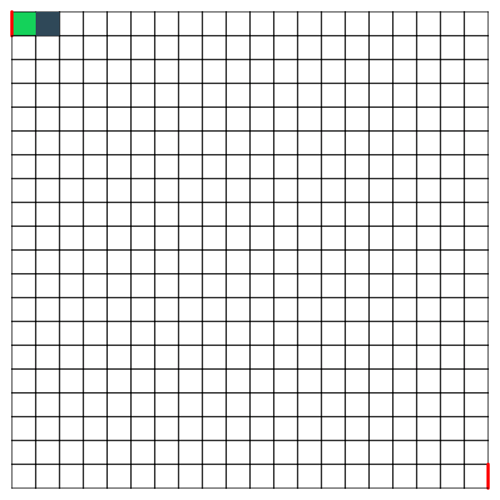

# maze-generation-iterative
Maze Generation - Iterative Implementation (with stack) in p5.js

## Graph theory based methods
A maze can be generated by starting with a predetermined arrangement of cells (most commonly a rectangular grid but other arrangements are possible) with wall sites between them. This predetermined arrangement can be considered as a connected graph with the edges representing possible wall sites and the nodes representing cells. The purpose of the maze generation algorithm can then be considered to be making a subgraph in which it is challenging to find a route between two particular nodes.

If the subgraph is not connected, then there are regions of the graph that are wasted because they do not contribute to the search space. If the graph contains loops, then there may be multiple paths between the chosen nodes. Because of this, maze generation is often approached as generating a random spanning tree. Loops, which can confound naive maze solvers, may be introduced by adding random edges to the result during the course of the algorithm.

The animation shows the maze generation steps for a graph that is not on a rectangular grid. First, the computer creates a random planar graph G shown in blue, and its dual F shown in yellow. Second, the computer traverses F using a chosen algorithm, such as a depth-first search, coloring the path red. During the traversal, whenever a red edge crosses over a blue edge, the blue edge is removed. Finally, when all vertices of F have been visited, F is erased and two edges from G, one for the entrance and one for the exit, are removed.

## Iterative implementation (with stack)
A disadvantage of the first approach is a large depth of recursion – in the worst case, the routine may need to recur on every cell of the area being processed, which may exceed the maximum recursion stack depth in many environments. As a solution, the same backtracking method can be implemented with an explicit stack, which is usually allowed to grow much bigger with no harm.

1. Choose the initial cell, mark it as visited and push it to the stack
2. While the stack is not empty
    1. Pop a cell from the stack and make it a current cell
    2. If the current cell has any neighbours which have not been visited
        1. Push the current cell to the stack
        2. Choose one of the unvisited neighbours
        3. Remove the wall between the current cell and the chosen cell
        4. Mark the chosen cell as visited and push it to the stack

## Generated Maze

